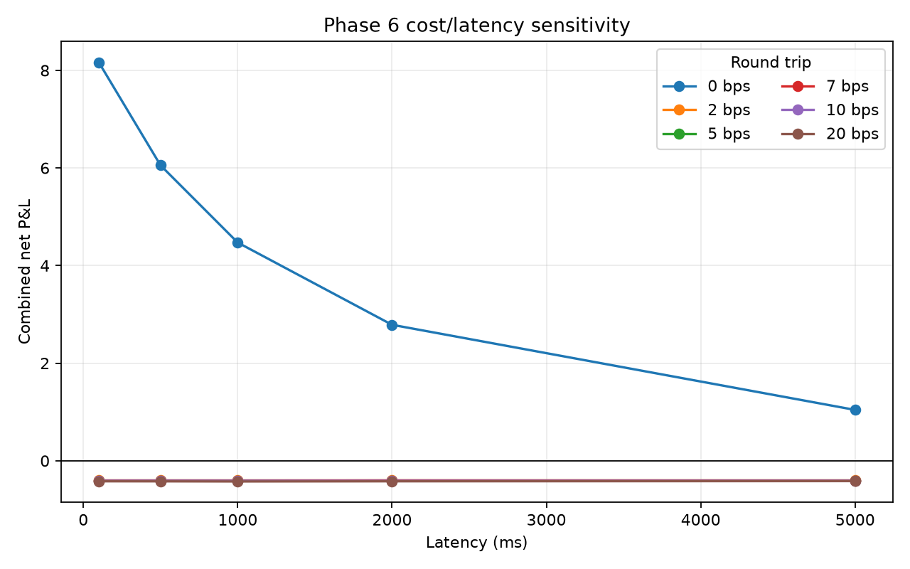

# Spot-Perpetual Price Discovery Research Lab

This project investigates whether signed trading activity in BTC and ETH USD-M
perpetual futures adds out-of-sample information about subsequent spot returns after
controlling for spot-market information, and whether that relationship survives
explicit latency and transaction-cost assumptions. The frozen final holdout finds
incremental statistical predictability but rejects economic viability under the
registered trading assumptions.

## Current status

Phases 0–8 are complete. On the untouched ten-day final holdout, the frozen BTC model
achieved OOS R-squared of **0.01763**, Pearson IC of **0.1334** and rank IC of
**0.1982** across 863,926 observations. Prediction-decile realised returns were
monotonic. The registered strategy generated +2.8486 gross P&L, but its 86,405 trades
incurred 60.4835 in modeled costs: net P&L was **−57.6349**, and break-even round-trip
cost was only **0.3297 bps**. The result supports short-horizon forecast association,
not tradability or causality.

The central Phase 6 confirmation result was also a clear economic null: at the
registered 500 ms latency and 7 bps all-in round-trip cost, the risk-limited BTC/ETH
portfolio produced +0.0210 gross P&L but −0.4072 net P&L. Its break-even round-trip
cost was only 0.343 bps. With zero costs, gross P&L fell from 8.165 at 100 ms to 1.042
at 5 seconds, so both cost and latency materially erode the statistical signal.

Phase 7 adds a bounded C++20/pybind11 two-market replay kernel with strict parity to
its pure-Python reference. On the frozen two-million-event equivalent-work benchmark,
Python processed 560,400 events/s and C++ processed 45.8 million events/s: an 81.76x
kernel speed-up. This is not a Polars or end-to-end pipeline speed-up.

On the prespecified 2025-02-01 through 2025-02-20
confirmation period, BTC Ridge OOS R-squared was 0.02428 with expanded
spot/perpetual features versus 0.01031 with spot-only features. The registered
limited XGBoost search selected depth 2 and 200 trees using January validation only;
its untouched-confirmation OOS R-squared was 0.03030. Its daily MSE improvement over
expanded Ridge had a paired day-block bootstrap 95% interval of
[1.604e-10, 2.446e-10], satisfying the frozen final-selection rule.

The 900-second alignment placebo returned to baseline-like OOS R-squared (0.01023),
and the incremental Ridge result replicated on ETH (0.01307 expanded versus 0.00457
baseline). Signal strength declined from the one-second to ten-second horizon but
remained positive in both volatility regimes.

Fees, slippage, a spread proxy, latency and position rules are explicit, but aggregate
trades cannot model the book, queue position or market impact. See the
[`final report`](docs/final_report.md),
[`final summary`](reports/final/final_summary.md),
[`Phase 6 summary`](reports/development/phase6_summary.md),
[`Phase 6 protocol`](docs/phase6_protocol.md),
[`Phase 7 benchmark`](reports/development/phase7_benchmark.md),
[`Phase 5 summary`](reports/development/phase5_summary.md), frozen
[`Phase 5 protocol`](docs/phase5_protocol.md),
[`holdout-opening record`](docs/holdout_opening_record.md) and
[`limitations`](docs/limitations.md).

Phase 3 generated 172,793 one-second BTC decision rows with 157 explicitly lagged
predictors and six future-return/direction labels. Definitions are in
[`docs/feature_dictionary.md`](docs/feature_dictionary.md); these are descriptive
data artifacts, not evidence of predictability. A repeat build reproduced feature
manifest hash
`c2b991aec9bf8b6f4b1da1a8ea801eeb849f0361a56a75eb053cb4d814da00c4`.

## Quick start

```bash
python3.12 -m venv .venv
. .venv/bin/activate
python -m pip install -e '.[dev]'
spot-perp show-config --config configs/smoke.yaml
spot-perp download --config configs/smoke.yaml
spot-perp normalise --config configs/smoke.yaml
spot-perp validate --config configs/smoke.yaml
spot-perp features --config configs/smoke.yaml
# After building the full development configuration:
spot-perp train --config configs/development.yaml
spot-perp confirm \
  --development-config configs/development.yaml \
  --confirmation-config configs/confirmation.yaml
spot-perp backtest --config configs/phase6.yaml
spot-perp benchmark-replay --events-per-market 1000000 --repeats 3
pytest
ruff check .
mypy
```

With `uv` installed, `uv sync --extra dev` and `uv run ...` can be used instead.

## Research safeguards

- Time splits only; observations are never randomly shuffled.
- The research design was frozen before the remaining development data was accessed;
  the final holdout was opened and evaluated exactly once after all prior phases.
- Spot aggregate trades from 2025 onward use microsecond timestamps, while the
  sampled USD-M futures archive uses milliseconds.
- “Flow imbalance” means signed aggregate-trade flow, not order-book imbalance.
- Gross and net trading results are reported separately.

## Planned workflow

```text
official ZIP + checksum -> validated raw archive -> normalised Parquet
-> leakage-safe features -> walk-forward models -> latency/cost backtest -> report
```

The detailed source of truth is
[`Spot_Perpetual_Project_Implementation_Plan.md`](Spot_Perpetual_Project_Implementation_Plan.md).

## Phase 2 data guarantees

- Downloads are streamed to atomic temporary files, SHA-256 verified, and cached.
- Corrupted cache entries are detected and repaired from the official source.
- Spot and USD-M futures schemas are parsed explicitly from ZIP without retained CSVs.
- Timestamp scale and UTC partition date are validated before nanosecond conversion.
- Maker flags are validated before deriving buyer/seller aggressor signs.
- Parquet is partitioned by symbol, market type and UTC date.
- DuckDB checks schema, ordering, identifiers, signs, nulls and numeric sanity.
- Re-running the smoke pipeline produces the same Parquet and manifest hashes.

## Phase 3 leakage controls

- Trades enter the first 100 ms bar boundary strictly after their event timestamp.
- Every predictor is shifted by one complete 100 ms bar before one-second sampling.
- Spot and perpetual inputs meet on an exact common grid; no future as-of match exists.
- Future-return labels are constructed separately and excluded from predictors.
- Daily tail labels are null when their horizon is unavailable.
- Feature validation rejects unsorted/duplicate decisions, non-finite values, invalid
  cutoff times, and flow imbalances outside their mathematical bounds.

## Phase 4 research controls

- The hypothesis, predictor sets, dates, folds, model parameters, metrics and
  selection rule were content-hashed before downloading the remaining development
  dates.
- Four expanding whole-day folds use a ten-second train purge and evaluation embargo.
- Median imputation and standardisation are fit inside each training fold only.
- Baseline and expanded specifications are compared for the same model class.
- Reports retain fold/day metrics, model failures, a paired 2,000-replicate day-block
  bootstrap and separate HAC inference.
- The preferred Ridge/expanded specification is fixed for Phase 5 confirmation; the
  final holdout cannot be opened by the CLI while marked `sealed`.

## Phase 5 confirmation controls

- The XGBoost grid, January tuning split, robustness checks and final-selection rule
  were hashed before any February confirmation archive was accessed.
- XGBoost tuning used January only; all February confirmation rows were scored once
  without refitting or hyperparameter changes.
- Placebo alignment, fixed development-volatility regimes, one/five/ten-second
  horizons and ETH replication are retained as separate diagnostics.
- The selected XGBoost/expanded specification is content-addressed in
  `data/manifests/final-model-specification.json`.
- The final 2025-02-21 through 2025-03-02 holdout was opened only after the Phase 8
  evaluator and protocol were tested and content-hashed.

## Phase 6 execution controls

- Entry is the first observed spot trade after decision time plus positive latency;
  exit is the first observed trade at least five seconds after entry.
- Positions never overlap within an asset, and timing tests prohibit execution on the
  feature/decision event.
- Gross and net P&L remain separate across five latencies and six all-in round-trip
  cost assumptions.
- BTC/ETH weights use January inverse volatility, total portfolio gross risk is
  normalised, and a 2% daily closed-trade loss limit stops new entries.
- Daily P&L is reconciled exactly to content-addressed Parquet trade ledgers.



## Phase 7 replay controls

- A pure-Python two-market merge/fixed-grid reference defines the component contract.
- C++20 and Python outputs match exactly for integer columns and within `1e-12` for
  floating-point columns, including empty streams, ties, duplicates and boundaries.
- Decreasing timestamps, malformed columns and invalid grids are rejected in both
  implementations.
- The extension builds through CMake, pybind11 and scikit-build-core; CI imports the
  compiled module before running parity tests.
- Benchmark timing excludes generation, imports, parity checks and report writing and
  compares the identical in-memory operation only.

## Phase 8 final-holdout controls

- The immutable sealed configuration, one-time open configuration, protocol, model
  specification, Phase 6 assumptions and evaluator were hashed before access.
- All 40 archives (88,965,078 trades) and 20 feature partitions passed checksum,
  structural and manifest-reconciliation checks before scoring.
- The registered model was refit once on pre-final data and scored every eligible BTC
  final row; no model, feature, horizon, threshold, cost or latency changed afterward.
- A final-evaluation manifest records every metric and artifact hash, and the CLI
  refuses a second evaluation while that manifest exists.


