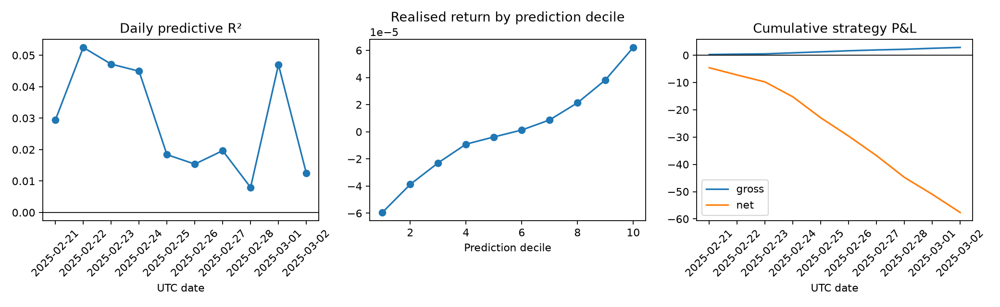

# Final research report

## Finding

The frozen final holdout supports the statistical price-discovery hypothesis but not
the registered trading hypothesis. On 863,926 eligible BTCUSDT observations from
2025-02-21 through 2025-03-02, the prespecified XGBoost/expanded model achieved
training-mean-referenced OOS R-squared of 0.017629, Pearson IC of 0.133406 and rank IC
of 0.198230. Mean realised returns rose monotonically across all ten prediction
deciles, from -5.946e-5 in the bottom decile to +6.213e-5 in the top decile.

The registered execution rule generated 86,405 non-overlapping trades. At 500 ms
latency and before costs, gross P&L was +2.848618. The frozen 7 bps round-trip cost
was 60.4835, producing net P&L of -57.634882. Break-even round-trip cost was only
0.329682 bps. The signal is therefore statistically detectable in this sample but
does not survive the prespecified friction assumption.

## Design and provenance

Development covered 2025-01-02–2025-01-31; confirmation covered
2025-02-01–2025-02-20; the final period remained sealed until the one-time evaluation.
Before opening, the model, target, expanded feature list, training subsample, economic
threshold, latency, holding period, cost and evaluator were content-hashed. The evaluator passed
all 54 project tests, including a synthetic end-to-end one-time test, before access.

The final model was then refit once on 863,929 registered every-five-second training
rows spanning development plus confirmation and scored on every eligible final row.
The data pipeline checksum-verified and structurally validated 40 public Binance
archives containing 88,965,078 trades. Its 20 feature partitions reconcile to the
source manifest. The sole evaluation is recorded by manifest
`3c2edcd0787106eb990af0d44ca7ffd8922cdead33c87d3cf2f669931a12d0f7`.

## Interpretation

The confirmation and final estimates agree directionally: perpetual and cross-market
features contain short-horizon information about subsequent spot returns beyond the
spot-only baseline. That evidence is predictive, not causal. Common reactions, venue
clock effects and construction choices remain possible explanations.

The economic null is the more decision-relevant result. The apparent edge is small
relative to plausible trading friction and requires extreme turnover. Gross P&L is
not an executable return because aggregate trades omit quotes, depth, queue priority,
market impact and adverse selection. The 7 bps result should therefore be read as a
transparent rejection of the registered strategy, not as a precise live backtest.

## Limitations

The final period is ten contiguous days on one venue and one primary asset. Overlapping
five-second labels make observations dependent; daily summaries provide only ten
blocks. Annualised risk ratios over that window are unstable and are not evidence of
long-run performance. No post-opening model, feature, threshold, latency or cost
selection was performed. Broader claims require independently registered data from
other venues, assets and market regimes.
